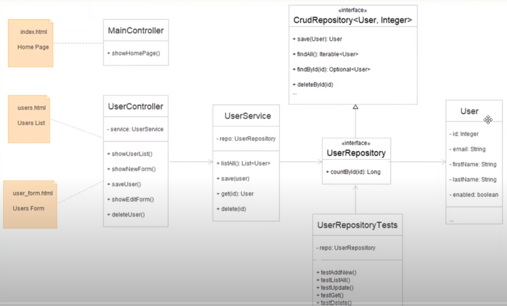
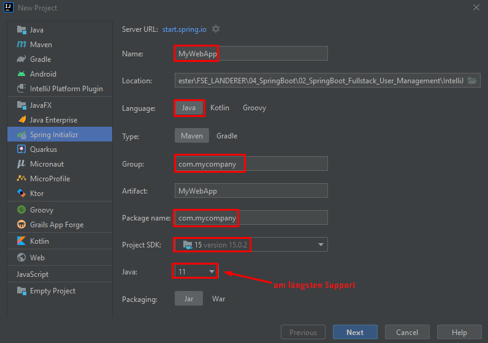
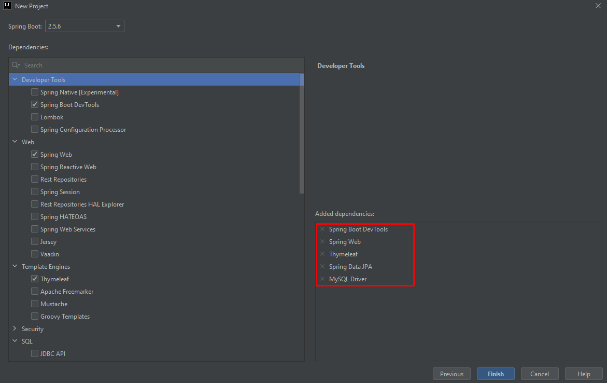
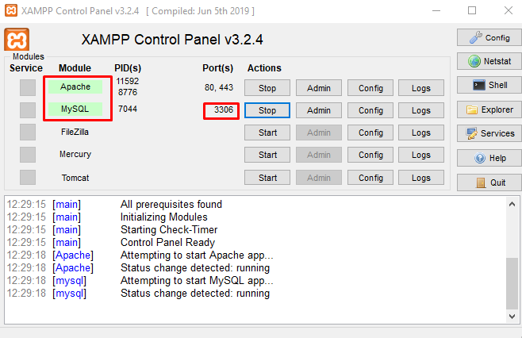
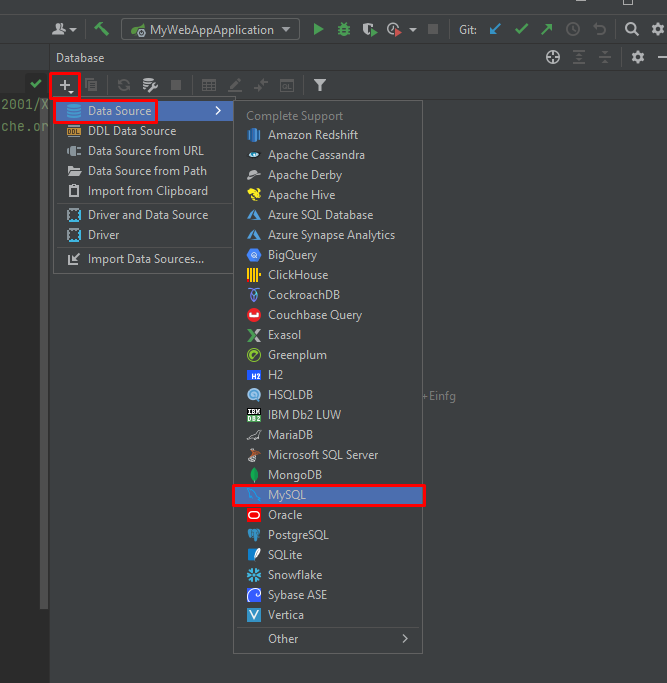
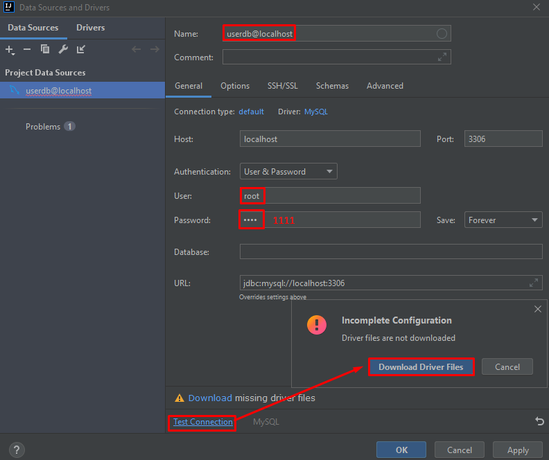
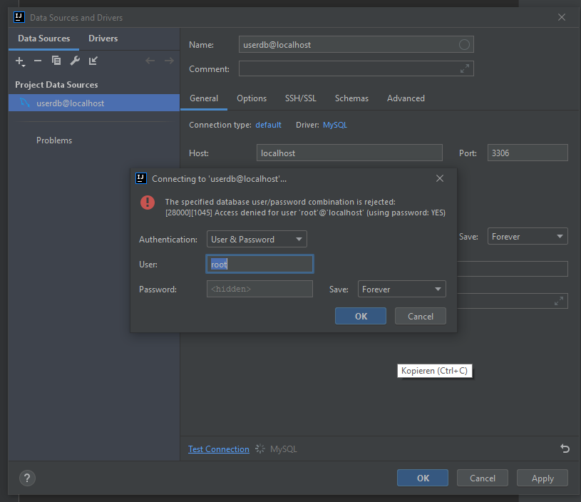
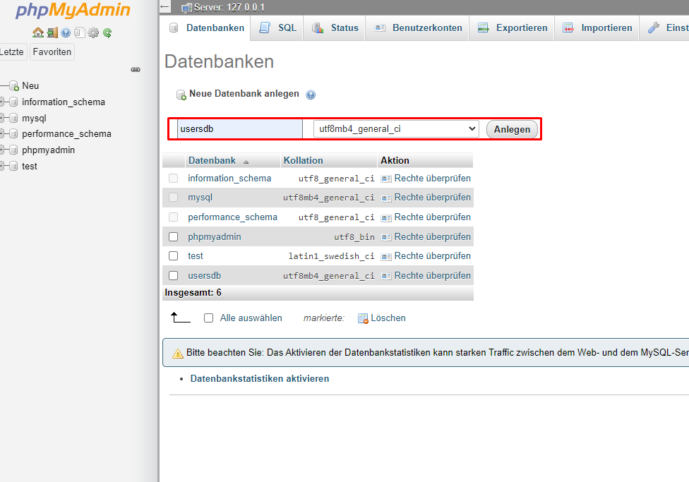
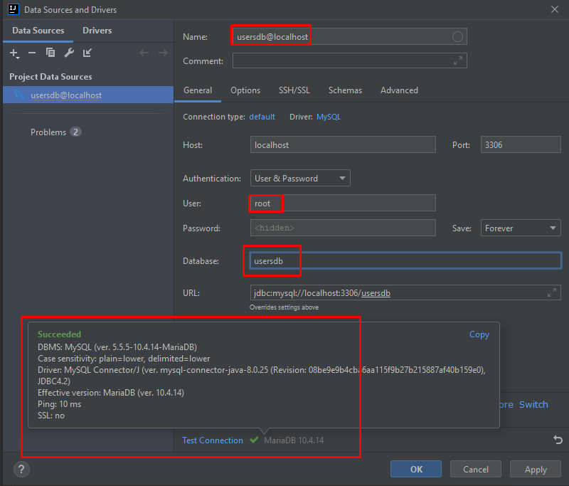
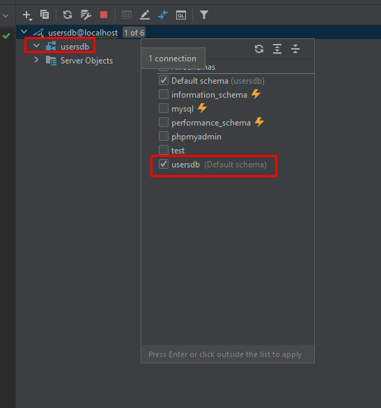

# Spring Boot - Dokumentation

## Aufgabe 2 : Spring Boot Fullstack User-Management
**Link zum Tutorial**  
[Youtube - Spring Boot CRUD Tutorial with IntelliJ IDEA, MySQL, JPA, Hibernate, Thymeleaf and Bootstrap](https://www.youtube.com/watch?v=u8a25mQcMOI&ab_channel=CodeJava)  

---
**In diesem Tutorial wird gelernt**
* die Entwicklung einer Web-Applikation basierend auf dem Spring Framework
* Code User Modul it CRUD Operationen (Create, Retrieve, Update and Delete)
---
**Folgende Technologien werden verwendet**
* Spring Boot Web
* Spring Data JPA & Hibernate
* MySQL Database
* Thymeleaf
* HTML5 & Bootstrap
* JUnit 5 & AssertJ

### UML

### ***Create & Setup Project***

1. Dependencies for:
   * Spring Web
   * Spring Data JPA
   * Thymeleaf
   * MySQL JDBC Driver
   * Spring Boot DevTools
   * Webjars für Bootstrap
2. Create new database schema
3. Configure Datasource in application.properties

---
> Neues Projekt anlegen

> Dependencies

- **Spring Boot DevTools**  
  Schnelle Anwendungsneustarts, Live-Reload und Konfigurationen für eine verbesserte Entwicklungserfahrung
- **SpringWeb**  
  Erstellung von Webanwendungen, einschließlich RESTful, mit Spring MVC. Verwendet Apache Tomcat als standardmäßig eingebetteten Container
- **Thymeleaf**  
  Eine moderne serverseitige Java-Template-Engine für Web- und Standalone-Umgebungen. Ermöglicht die korrekte Darstellung von HTML in Browsern und als statische Prototypen. 
- **Spring Data JPA**  
  Persistieren von Daten in SQL-Speichern mit Java Persistences API unter Verwendung von Spring Data und Hibernate
- **MySQL Driver**  
  Stellt MySQL JDBC und R2DBC Driver bereit
  
- Mit Finish wird das Projekt erstellt

### ***Neue Data Source erstellen***

> SQL-Server starten über XAMPP, Port 3306

> Neue Data-Source hinzufügen

> Fehler beim Testen der Verbindung

- Ewig lange Fehlersuche weil man den Youtube-Typ einfach nicht versteht :/
- Schließlich hab ich über PhpmyAdmin eine neue Datenbank usersdb erstellt und den user ohne passwort verbunden. 
> Neue Datenbank phpMyAdmin

> Mit Datenbank über IntelliJ verbinden

> Es wird dann automatisch mit dem usersdb Schema verbunden

### ***Konfigurieren der DataSource Properties***

> Im File application.properties werden die Einstellungen für die aktuelle Datenbank geschrieben. 

Erläuterung Zeile für Zeile:
- Pfadangabe mySQL-Server mit Socket und DB-Name
- Setzt den Benutzernamen
- Hier wird dann Passwort gesetzt
- Dadurch bleiben die Daten beim Neustart erhalten
- SQL-Debugging in der Konsole

---

## Aufgabe 3 : Spring Boot Fullstack Department-Management
**Link zum Tutorial**  
[Youtube - Spring Boot Tutorial | Full In-depth Course](https://www.youtube.com/watch?v=c3gKseNAs9w&ab_channel=DailyCodeBuffer)

---
## Aufgabe 4 : Spring Data JPA Vertiefung
**Link zum Tutorial**  
[Youtube - Spring Data JPA Tutorial | Full In-depth Course](https://www.youtube.com/watch?v=XszpXoII9Sg&ab_channel=DailyCodeBuffer)

---
