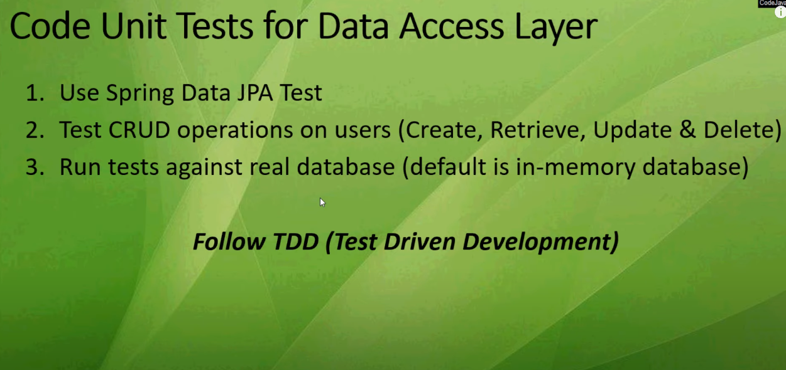
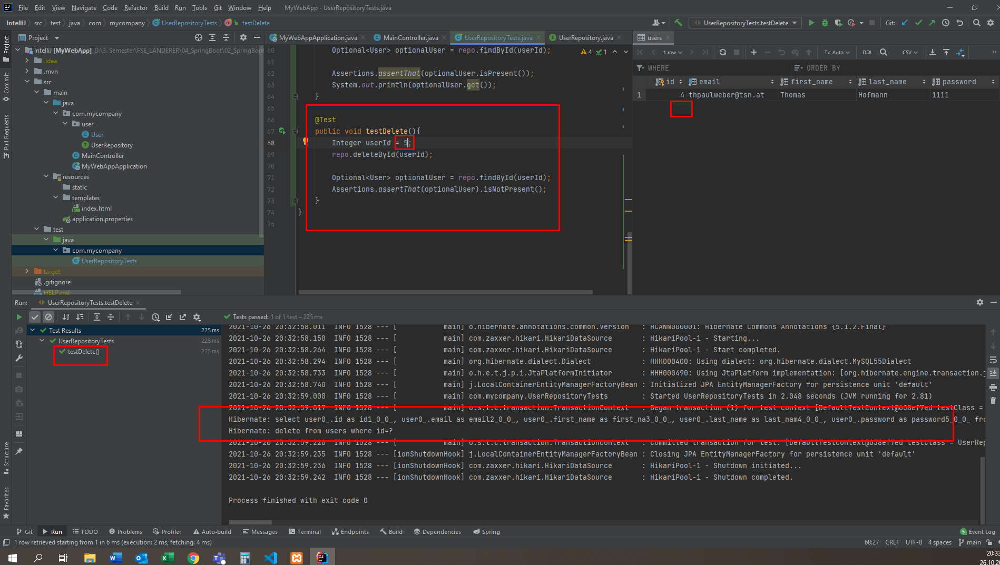

# Spring Boot - Dokumentation

## Aufgabe 2 : Spring Boot Fullstack User-Management
**Link zum Tutorial**  
[Youtube - Spring Boot CRUD Tutorial with IntelliJ IDEA, MySQL, JPA, Hibernate, Thymeleaf and Bootstrap](https://www.youtube.com/watch?v=u8a25mQcMOI&ab_channel=CodeJava)  

---
**In diesem Tutorial wird gelernt**
* die Entwicklung einer Web-Applikation basierend auf dem Spring Framework
* Code User Modul it CRUD Operationen (Create, Retrieve, Update and Delete)
---
**Folgende Technologien werden verwendet**
* Spring Boot Web
* Spring Data JPA & Hibernate
* MySQL Database
* Thymeleaf
* HTML5 & Bootstrap
* JUnit 5 & AssertJ

### UML

### ***Create & Setup Project***

1. Dependencies for:
   * Spring Web
   * Spring Data JPA
   * Thymeleaf
   * MySQL JDBC Driver
   * Spring Boot DevTools
   * Webjars für Bootstrap
2. Create new database schema
3. Configure Datasource in application.properties

---
#### Neues Projekt anlegen

#### Dependencies

- **Spring Boot DevTools**  
  Schnelle Anwendungsneustarts, Live-Reload und Konfigurationen für eine verbesserte Entwicklungserfahrung
- **SpringWeb**  
  Erstellung von Webanwendungen, einschließlich RESTful, mit Spring MVC. Verwendet Apache Tomcat als standardmäßig eingebetteten Container
- **Thymeleaf**  
  Eine moderne serverseitige Java-Template-Engine für Web- und Standalone-Umgebungen. Ermöglicht die korrekte Darstellung von HTML in Browsern und als statische Prototypen. 
- **Spring Data JPA**  
  Persistieren von Daten in SQL-Speichern mit Java Persistences API unter Verwendung von Spring Data und Hibernate
- **MySQL Driver**  
  Stellt MySQL JDBC und R2DBC Driver bereit
  
- Mit Finish wird das Projekt erstellt

### ***Create new DataSource***

#### SQL-Server starten über XAMPP, Port 3306

#### Neue Data-Source hinzufügen

#### Fehler beim Testen der Verbindung

- Ewig lange Fehlersuche weil man den Youtube-Typ einfach nicht versteht :/
- Schließlich hab ich über PhpmyAdmin eine neue Datenbank usersdb erstellt und den user ohne passwort verbunden. 
#### Neue Datenbank phpMyAdmin

#### Mit Datenbank über IntelliJ verbinden

#### Es wird dann automatisch mit dem usersdb Schema verbunden

### ***Konfigurieren der DataSource Properties***

#### Im File application.properties werden die Einstellungen für die aktuelle Datenbank geschrieben. 

Erläuterung Zeile für Zeile:
- Pfadangabe mySQL-Server mit Socket und DB-Name
- Setzt den Benutzernamen
- Hier wird dann Passwort gesetzt
- Dadurch bleiben die Daten beim Neustart erhalten
- SQL-Debugging in der Konsole

### ***Code Home Page***

#### Schritte

#### Erstellen eines neuen Java-Files "Main-Controller" im package com.mycompany

- Annotation Controller 
- Annotation GetMapping um das Request zu handeln von der Homepage
- showHomePage gibt den den view der index zurück
#### index.html

#### Die Application zum ersten Mal starten und testen

#### Ausgabe von logs auf der Konsole von Spring Boot

#### Testen im Browser

### ***Configure IntelliJ IDEA for Spring Boot DevTools***
#### Das Einstellen zum automatischen kompilieren war bei mir nicht verfügbar wie im Video angezeigt. 

#### Nach langem Googlen gefunden in den Advanced Settings

#### Weiters muss eingestellt werden: 

- Jetzt können zB Änderungen an der index.html vorgenommen werden und es wird automatisch kompilliert ohne Application abzubrechen und neu zu starten
---

### ***Use Bootstrap for Project***

#### In der pom.xml muss nun auch eine Abhängigkeit für Bootstrap geschrieben werden, damit Bootstrap im Projekt verwendet werden kann. 

#### Im index.html-File muss bootstrap als stylesheet nun eingebunden werden; Weiters wird im html-Tag noch ein xmlns-Attribut für thymeleaf eingebunden. Es ist schwer den Inder zu verstehen, aber wenn ich es richtig verstanden habe hat man damit die Möglichkeit, über dieses th Zugriff auf Daten über Thymeleaf zu bekommen.

#### Es hat auf jeden Fall dann funktioniert, Bootstrap ist eingebunden und die Seite wurde auch gleich aktualisiert. 

### ***Code Data Access Layer***

1. Code user entity class that maps to users table in database
2. Code UserRepository interface to use APIs of Spring Data JPA
3. Run the application to let Hibernate create the table

- Erstellen der User-Class 
- Erstellen des UserRepository Interface welches das CrudRepository Interface implementiert

#### Neues Package für User, neue User-Klasse

- Annotation Entity und Table, damit die Klasse als Tabelle in die Datenbank übertragen werden kann
- Annotationen Id und GeneratedValue wird ein Attribut als Primärschlüssel festgelegt. 
- Annotation Column werden Eigenschaften für eine Spalte festgelegt.
- Getter und Setter generieren lassen

#### Die Tabelle users wurde inszwischen automatisch erstellt von JavaSprings

#### Dis ist auch im IntelliJ zu erkennen

#### Neues Interface UserRepository

- Durch dieses UserRepository Interface, welches von CrudRepository erbt, können die CRUD-Funktionen (Create, Read, Update, Delete) an einem Modell angewendet werden. Weiters müssen die generischen Datentypen für die Entität und den Primärschlüssel angegeben werden
- User = Datentyp der Model-Klasse User
- Integer = Datentyp des Primärschlüssels der Klasse User
- ALLES SELBER MÜHSAM ZUSAMMENGESUCHT WEIL ABSOLUT KEINE CHANCE WAR DEN INDER ZU VERSTEHEN, ZUM KOTZEN

#### Hibernate (siehe Logeinträge von Spring Boot)

- Hibernate-Framework wird in dem Projekt eingesetzt, um Objekte mit Attributen und Methoden in eine RDBS zu speichern und umgekehrt um eine Tabelle in ein Objekt zu übersetzen (Objektrelationale Abbildung). 
- Die Anweisungen für den Datenbankzugriff wird nicht über SQL programmiert, sondern über Hibernate (Abhängigkeit von verwendetem SQL-Dialekt)

### ***Code Unit Tests***

#### Schritte

#### UML

#### Löschen des automatisch generierten MyWebApplicationTests.java-File und erstellen der neuen Klasse UserRepositoryTest

#### Mit UserRepositoryTests kann nun überprüft werden, ob Interface UserRepository in Verbindung mit dem User-Modell und den CRUD-Methoden richtig zusammenspielt. 
#### Aufbau und Annotationen

- Annotation DataJpaTest um die Tests durchführen zu können
- Annotation AutoConfigureTestDatabase um die Datenbank testen zu können
- Annotation Rollback um die Daten zu behalten
- Annotation Autowired um eine Referenz auf der User Repository zu haben.
- Annotation Test um Test-Methoden zu schreiben

#### Methode testAddNew

- Erstellt eine neue Instanz von User
- Über die Setter-Methoden werden die Daten des Users geschrieben
- Einer neuen User-Instanz wird dieser User über die save-Methode vom implementierten CRUD-Repo übergeben. 
- Über Assertions wird geprüft, ob der gespeicherte User nicht NULL ist und die ID größer als 0 ist. 
- Danach kann die Methode ausgeführt bzw getestet werden

- Die Einträge in der Datenbank können dann auch über IntelliJ betrachtet werden
  
#### Methode testListAll

- Gibt eine Interable-Collection zurück
- Dies übergibt einer neuen Instanz von Iterable
- Mit einer Assertion wird überprüft ob die Collection größer als 0 ist.
- Über ein for-each Schleife können dann die Einträge auf der Konsole ausgegeben werden
- Dazu ergänzt man die User-Klasse noch um die toString Methode. 

#### Methode testUpdate

- über die Methode findById() von der CRUD-Repo wird über die ID eine Instanz von Optional zurückgegeben. Dies übergibt man einer neuen Instanz von Optional mit Typ User.  
- Über die Methode get des Optional-User Objekts, wird einer neuen Instanz von User der gewünschte User übergeben.
- über diese Instanz kann nun zB über die setPassword Methode einen neues Passwort gesetzt werden. 

#### Methode testGet

- Ähnlich wie die testUpdate Methode

#### Methode testDelete

- Über die Methode deleteByID() von der CRUD-Repo kann über die ID ein User aus der Datenbank gelöscht werden. 

### ***Code Users Listing Page***

#### Damit die Benutzer verwaltet werden können, muss einiges implementiert werden.

#### Neue Klasse UserService

- Annotation Service
- Annotation Autowired als Referenz zum UserRepository
- Mit der Methode listAll() wird eine Liste zurückgegeben über die Methode findAll() des CRUD-Repo.

#### Neues HTML-File users und neue Klasse UserController

- **user.html**
- Ein neues Template users.html zur Ausgabe der gespeicherten Benutzer über thymeleaf. Das geht, weil ein Objekt vom Typ Model vom UserController wird an das Template users.html übergeben wird. ( eine List mit allen Usern) 
- **UserController**
- Annotation Controller
- Annotation Autowired als Referenz zu UserService
- Wird im Browser "Manage Users" der index.html angeklickt, wird über GetMapping die Methode showUserList() ausgeführt, welche wiederum aus der UserService Klasse alle Benutzer als List holt. 
- Die Benutzer werden dann als Model-Objekt der users.html zur Verfügung gestellt
- users.html wird so im Browser angezeigt

### ***Code Add User Function***

#### UML

#### Bearbeitung vom UserController

- Neue GetMapping Referenz zum Erstellen der Methode showNewForm(), damit bei Klick auf add new User im index.html das Forumular für den neuen user angezeigt wird. 
- diese User_form.html muss nun erstellt werden

#### Erstellen Template user_form.html

- Zum Anzeigen eines Formulars um neuen User zu speichern
- im Form-Tag wird ein Objekt vom Typ "User" referenziert damit dieses neue Objekt (User) gespeichert werden kann. 
- in den Input-Feldern muss über tymeleaf das Datenfeld aus dem User-Model eingetragen werden

### ***Code Form Validate***

####

###

   

---
---

## Aufgabe 3 : Spring Boot Fullstack Department-Management
**Link zum Tutorial**  
[Youtube - Spring Boot Tutorial | Full In-depth Course](https://www.youtube.com/watch?v=c3gKseNAs9w&ab_channel=DailyCodeBuffer)

---
## Aufgabe 4 : Spring Data JPA Vertiefung
**Link zum Tutorial**  
[Youtube - Spring Data JPA Tutorial | Full In-depth Course](https://www.youtube.com/watch?v=XszpXoII9Sg&ab_channel=DailyCodeBuffer)

---
