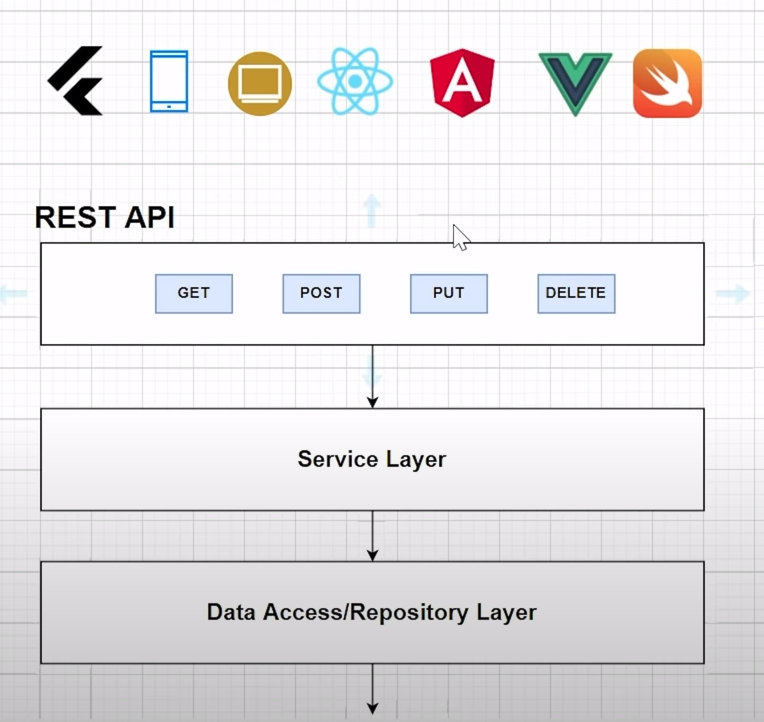
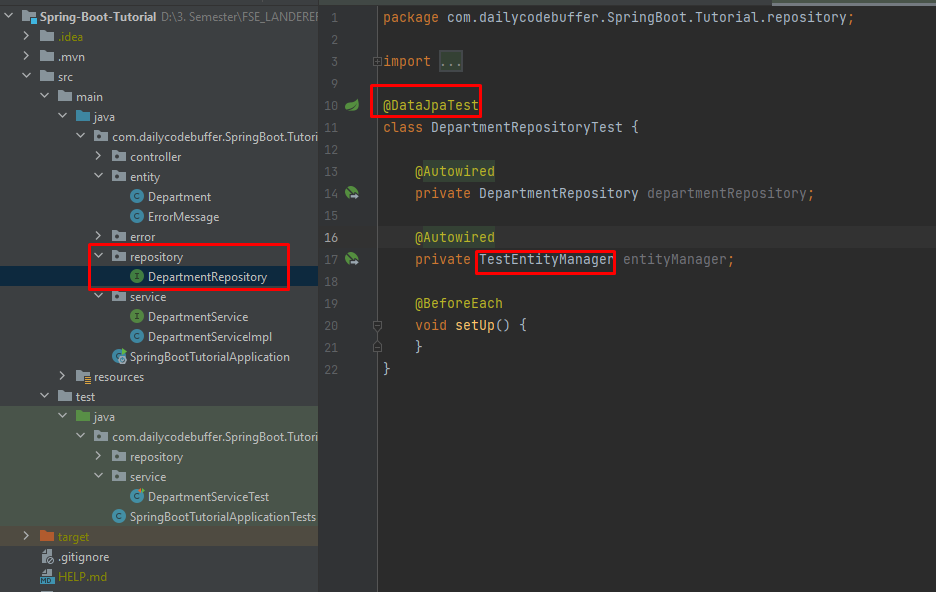

# Spring Boot - Dokumentation

## Aufgabe 3 : Spring Boot Fullstack Department-Management
**Link zum Tutorial**  
[Youtube - Spring Boot Tutorial | Full In-depth Course](https://www.youtube.com/watch?v=c3gKseNAs9w&ab_channel=DailyCodeBuffer)

---
---

### ***Spring Initializr***

#### Initialisieren des Projekts mit start.spring.io

- Hier kann man wie im IntelliJ direkt, ein Projekt mit SpringBoot initialisieren mit allen benötigten Abhängigkeiten

- Geht man auf Explore, kann man durch eine Vorschau sehen, was generiert werden würde

- Nun kann das Projekt generieren, und auch mit dem Share-Button einen Link teilen, der die Einstellungen zu diesem Projekt enthält

---
---

### ***Springboot IDE´s (IntelliJ IDEA, STS, VSCode,...)***

#### Laden des Projekts mit IntelliJ

- Nach dem Generieren des Projektes mit start.spring.io, kann man die Datei entpacken und das gesamte Projekt in das gewünschte Verzeichnis verschieben
- Anschließend öffnet man in IntelliJ die pom.xml-Datei und das Projekt wird geladen. 

---
---

### ***Springboot Starters***

#### Dependencies in den Starter-Dependencies

- die über start.spring.io ausgewählten Starter-Dependencies, enthalten auch jede Menge Abhängigkeiten die man dann benutzen kann

---
---

### ***Creating Simple API***

#### Neues Package, neuer Controller

- Die Programmierschnittstelle REST-API nutzt HTTP-Anfragen, um per PUT, GET, POST und DELETE auf Informationen zuzugreifen. Da REST das Verbinden mit Cloud-Diensten erlaubt und eine Interaktion ermöglicht, ist sie meist die erste Wahl. So sind REST-APIs zum Beispiel für Twitter, Amazon und Google im ständigen Einsatz
---

#### Spring erlaubt uns alle voreingestellten Properties zu ändern, wie zB der Standard-Port 8080 für Tomcat

---
---

### ***Running Springboot App***

#### Andere Annotation für RequestMapping, Starten der Application über das Terminal

- @GetMapping inkludiert bereits RequestMapping
- Über das Terminal kann der Run Befehl ausgeführt werden, mit Strg+C wird abgebrochen

---
---

### ***Spring Boot DevTools***

#### Neue Abhängigkeit, damit jede Änderung sofort übernommen wird, und die App nicht neu gestartet werden muss

- Dependency kann über start.spring.io ausgewählt werden, und mit EXPLORE kann dann der erstellte Code kopiert und in das Projekt in IntelliJ in der pom.xml übernommen werden. Maven aktualisieren und die neue Abhängigkeit wurde übernommen

#### Zusätzliche notwendige Einstellung in IntelliJ

- Nun muss die App nicht immer wieder neu gestarten werden, wenn Änderungen vorgenommen werden

---
---

### ***Architecture & Example***

#### Hier wird gezeigt, wie die kommende Aufgabe aufgebaut wird

- Die REST API
- Service Layer für die gesamte Buisness Logik
- Data Access / Repository Layer für die Interaktion mit der Datenbank
- Database ( zuerst mit H2, dann mit MySQL)

--- 
---

### ***Adding Dependency H2 & JPA***

#### Copy Paste von spring JPA starter in die pom.xml

- auf der start.spring.io kann das Dependency wieder ausgewählt, mit Explore betrachtet und dann kopiert und in die pom.xml des Intellij Projektes eingefügt werden. 

#### Konfigurieren der H2-Database

---
---

### ***Creating Springboot Components***

#### Neue Packages, erste Entity Department

- Damit die Entity Department mit der Database interagieren kann, muss sie mit der @Entity versehen werden.
- wieder setzen des Primary Key mit entsprechenden Annotations

#### DepartmentController 

- Annotation RestController für API

#### Interface und Klasse für Service 

- Annotation Service enthält auch @Component -> Spring

#### Repository Interface 

- Annotation Repository für die JPA-Repository
- erbt von JpaRepository mit allen bereits erstellten Methoden

---
---

### ***Department Save API***

#### Herstellung der Implementierungen zum Speichern

- @Autowired verbindet das Objekt mit dem Spring-Container
- @RequestBody erzeugt aus dem JSON-Objekt ein Objekt vom Typ Department
- Entkopplung mit den Implementierungen

---
---

### ***Testing APIs Using Rest Client***

#### Man muss anscheinend Insomnia installieren, wie das nun alles genau funktioniert hab ich nicht verstanden weil ich den Typ auch teilweise NULL verstehen kann. zum kotzen

- neue Collection erstellen
- new Request (POST)
- im Feld dann die URL eingeben zu den departments von H2

#### Format JSON wählen

#### Format JSON wählen

- Die Felder definieren (wie in Klasse Departments beschrieben)
- Die ID wird automatisch generiert
- 200 OK bedeutet der Request war erfolgreich

#### auf H2 kann man nun mit run sehen, dass die Daten übernommen wurden

---
---

### ***GetMapping_Fetching Data From DB***

#### GetMapping die eine List aller Einträge der Datenbank zurückgibt

- Diese Funktion übergibt uns alle Daten der Datenbank die verfügbar sind. 

#### Da die Daten beim beenden der App verloren gegangen sind, wurden 3 neue Einträge wie vorhin mit Insomnia erstellt und gesendet an die H2

#### Get Request auf Insomnia

  
---
---

### ***Fetching Data By ID***

#### Neue Methode mit GetMapping für die ID

#### Daten wurden wieder automatisch gelöscht (H2), 2 neue eingegeben; Durch Get-Request können jetzt sowohl alle Daten, als auch bestimmte IDs zurückgegeben werden

---
---

### ***Deleting Data***

#### Neue Methode mit @DeleteMapping mit der ID

#### Testen mit Insomnia

---
---

### ***Updating Data***

#### Neue Methode zum Updaten eines Departments mit @PutMapping

- Mit if-Abfragen wird überprüft, welche Felder des Datenfelders geändert werden wollen. Ergibt eine Abfrage 0 bzw nichts (also kein Update), wird es übersprungen
- Zum Schluss wird das gespeicherte Department (CRUD REPO) zurückgegeben. 

#### Testen mit Insomnia

- Wie programmiert, wird nur geändert was mit JSON gesendet wird, der Rest wird übersprungen

---
---

### ***Fetch Data By Name***

#### Neue Methode mit GetMapping um ein Department aus der Datenbank über den Namen zu finden

- Die Methode muss wieder im DepartmentController, im DepartmentService-Interface und der DepartmentServiceImpl geschrieben werden.
- Dieses kann aber nicht auf eine vordefinierte Methode zurückgegriffen werden und man muss selbst eine in das DepartmentRepository schreiben
- Hier reicht es aus den Methodenkopf so zu definieren, dass es heisst: findByDepartmentName. Wichtig hierbei Camelcase und die genau Bezeichnung des Datenfeldes von der Entity

#### Testen mit Insomnia

- wie man sieht, wird der Datensatz über den Department Name gefunden. 
- Allderdings ist hier die Groß- und Kleinschreibung wichtig. 

#### Noch eine Methode im DepartmentRepository

- Wie vorhin ist die Schreibweise hier wieder zu beachten
- Weiters muss diese Methode nun auch von ControllerServiceImpl aufgerufen werden.

#### Weiterer Test im Insomnia

- die suche funktioniert jetz auch so

#### so wie vorhin kann man die verschiedenen Möglichkeiten von JPA implementieren

- Auf dieser Seite sieht man wie mit den unterschiedlichen Methodennamen verschiedenes implementiert werden kann > 
[Spring Data JPA - Reference Doc](https://docs.spring.io/spring-data/jpa/docs/current/reference/html/#jpa.query-methods.query-creation)

#### **wie das nun genau funktioniert konnte ich leider wieder nicht verstehen weil ich wieder fast nichts verstanden habe von dem Inder**
---
---

### ***Hibernate Validation***
- um über die Lebenszeit hinaus auf die Daten zugreifen zu können

#### Hinzufügen der Abhängigkeit in der pom.xml

- spring-boot-starter-validation beinhaltet hibernate-validation

#### Validieren der Datenfelder

- um sicher zu stellen, dass der Name des Departments nicht leer ist, verwendet man die Annotation NotBlank. 
- Um die Datenfelder im PostMapping auf ihre Validation prüfen zu können, muss auch hier die Annotaion dafür gesetzt werden

#### Test im Insomnia

- Wie man sieht, gibt es hier einen Fehler 

#### Weitere Validations-Annotaions

- es gibt verschiedene Annotations zum Validieren der Datenfelder

#### **Wahrscheinlich hab ich ihn bezüglich des Speicherns falsch verstanden und es gut nur um die Validation.**

---
---

### ***Adding Loggers***
- Von der Einleitung hab ich mal kein Wort verstanden

#### Wenn ich ihn danach richtig verstanden habe, ist dies hilfreich zum Debuggen

---
---

### ***Project Lombok (Removing Boiler plate code)***

#### Was ist Lombok
-  lässt sich die Menge des Quellcodes durch den Einsatz von Lombok erheblich reduzieren und er wird durch das Weglassen des Boilerplate-Code erheblich lesbarer.
-  Getter, Setter usw können damit wegfallen

#### Implementierung

- auf start.spring.io das Dependency suchen 

- mit Explore den Code suchen und kopieren. Weiters muss auch das plugin kopiert werden.

- Einfügen in der pom.xml

- Das Plugin wurde bereits in Intellij installiert.

- Entfernen von Constructor, Getter, Setter, toString

- Mit Lombok kann man nun verschiedene Annoationen dazu laden
- Data implementiert alles; Getter nur Getter usw.
- NoArgsConstructor einen Konstruktor ohne Argmumente usw.

#### Testen

- und es läuft alles wie gewohnt
---
---

### ***Exception Handling***
- Damit die Fehlermeldungen übersichtlicher werden

#### Anpassung bei FetchDepartmentById
- bis jetzt wurde auf Insomnia immer ein Reihe von Parameter bei der Fehermeldung angezeigt, wenn nach einem Department gesucht wurde das nicht existiert. Durch das Exceptionhandling wird das jetzt angepasst

- Ein neues package errors wurde erstellt mit einer neuen Klasse DepartmentNotFoundException. In dieser Klasse wurde dann einfach alle möglichen Konstruktoren generiert.
- in der DepartmentServiceImpl-Klasse wurde die Methode für fetchDepartmentById umgeändert. Anstatt gleich das Department über das Repo zurückzugeben, wird aus dem Repo zuerst ein Optional-Objekt vom Typ Department übergeben. 
- Dieses Objekt wird nun auf seinen Zustand überprüft. ist er nicht vorhanden, wird die Exception geschmissen
- Diese Exception muss nun auch bei der GetMapping Methode für fetchDepartmentById im DepartmentController geschmissen werden. 

- Wie man sieht wird zwar die Message nun ausgegeben, die anderen Parameter aber auch. 

#### Das Handeln aller Exceptions

- Neue Klasse RestResponseEntitiyExceptionHandler welche erbt von ResponseEntityExceptionHandler
- @ControllerAdvice gibt Zugriff auf alle Controller. Es können aber auch mit anderen Annotationen auf bestimmte Controller zugegriffen werden.
- @ResponseStatus um den Status aufzufangen
- @ExceptionHandler kümmert sich um bestimmte Exception
- Die Methode departmentNotFoundException gibt eine ResponseEntity zurück mit dem Status NotFound und der Message dazu
- Durch Lombok spart sich bei der neuen Klasse ErrorMessage alle Getter und Setter und eben auch die Konstruktoren, weshalb auch hier auf den speziellen Konstruktor zugegriffen werden kann.

#### Testen

---
---

### ***Changing H2 to MySQL***

#### Installieren von MySQL
- Hab dies wieder wie im ersten Video mit XAMPP gemacht

#### Hinzufügen Dependency in pom.xml und ändern der application.properties für MySQL

#### Erstellen des Schemas dcbapp in phpMyAdmin

- Nach dem die App auf Intellij neu gestartet wurde, wurden autmatisch die Tabellen in MyAdmin erstellt

#### Hinzufügen von Datensätzen mit Insomnia

- nach dem Hinzufügen eines Datensatzen wurde es auch in phpMyAdmin aktuallisiert. 

---
---

### ***Unit Testing***

#### Dependency

- Testen aller Layer. Service-, Repository- und Controllerlayer
- Diese kann man auch einzeln testen und dazu "mocken". 
- Also wenn man nur den Controllerlayer testen möchte, kann man dies einstellen

---
---

### ***Unit Testing Service Layer***

#### Wo findet das testen statt?

- es schon beim erzeugen der Application ein test-package erzeugt mit der SpringBootTutorialApplicationTests-Klasse. 

#### Um einen ServiceLayer zu testen, kann in Intellij wie folgt implementiert werden

- Die Methoden können hier generiert werden oder selbst geschrieben werden. 

#### Testen der Methode fetchDepartmentByName

- Das package und die TestKlasse für den Service Layer wurden automatisch erstellt
- Die Methode setup() mit @BeforeEach wurde automatisch generiert. BeforEach führt dies für alle TestMethoden aus. Kann auch anders gemacht werden, zB BeforeAll
- Die neue Methode whenValidDepartmentName_ThenDepartmentShouldFound ist zwar lang, aber es ist ok. Sie soll genau aussagen was sie tut bzw was sie testet. 
- um den ServiceLayer zu testen muss ein Objekt in den Datenfeldern erzeugt werden und mit Autowired verknüpft werden
- Die Methode whenValidDepartmentName_ThenDepartmentShouldFound wird noch mit der Annotation Test versehen um zugriff auf diese zu haben

- da man ja nur den Service Layer testet möchte, aber auf das Repository zugreift, muss dieses "Gemockt" werden. Durch Mockito(mocken), können Objekte (Klassen oder Methoden) isoliert von ihrer Umgebung getestet werden. 
- Dazu wird ein Repository in den Datenfeldern erstellt. Durch die Annotation MockBean wird nun das Repo durch ein Mock-Objekt ersetzt und fungiert dabei nun als Platzhalter für ein echtes Repo-Objekt.  
- in der Methode setup wird nun ein TestObjekt vom Typ Department erstellt. Dies kann nun einfach hier ohne getter und setter gemacht werden aufgrund von Lombok und der Annotation Builder. 
- Durch den Platzhalter mit Mockito kann nun das isolierte Objekt verwendet werden. 

#### Testen

- durch die Annotation kann im Terminal statt der Methode auch eine andere Status Meldung angezeigt werden. 
- wie man sieht war der Test erfolgreich

---
---

### ***Unit Testing Repository Layer***

#### Um das package samt Klasse zu erzeugen geht man wie vorhin vor

#### Warum man diese Annoationen hier mit Entity Manager hab ich dem schlechten Englisch nicht verstanden

#### Implementierung

- Wenn ich es richtig verstanden habe, wird zum Testen ein Datensatz erzeugt der nicht in die Datenbank aufgenommen wird.

---
---

### ***Unit Testing Controller Layer***

#### Dieses mal wählt man zum testen bestimmte Methoden aus 

- Keine Ahnung was er da gredet hat dazu, keine chance zu verstehen

#### Implementierung ControllerTest 

- Irgendwas mit WebMvcTest, aber warum .. keine Chance ihn zu verstehen
- Unterm Strich sind die Daten wieder Mock und nichts wird in die Datenbank gespeichert. Test war auch ok. Aber leider nichts von dem Typ verstanden

#### Und die andere Methode...

- .. und wieder wenig verstanden

---
---

### ***Adding Config In Properties File***

#### Beispiel

- In diesem Beispiel sieht man, dass man über das properties-File auf bestimmte Werte zugreifen kann

---
---

### ****Adding application.yml***

#### Warum ein Yaml-File?
- lesbarer für menschen
- redundate Teile können entfernt werden

- Das Yaml-File ist im selben Verzeichnis wie das properties File
- Mit einem Online-Converter kann man die properties in yml übersetzen lassen und copy paste
- wie man sieht, ist das Yaml-File schlanker und leichter lesbarer. 
- das Configuration File ist zur Gänze auskommentiert, beim starten der App wird dann automatisch auch auf das Yml file zurückgegriffen und es geht alles wie vorhin. 

---
---

### ***SpringBoot Profiles***

#### Verschiedene Profile sind nützlich, zB für verschiedene Datenbanken

- Aber wieder furchtbar zum verstehen was er da redet
- mit --- kann mehrere Dokumente erstellen im Yml File wenn ich ihn richtig verstanden habe
- Man hat nun 3 Profile, mit 3 verschiedenen Datenbanken
- Aktiviert ist "qa", welche noch nicht existiert, darum schlägt das starten der App fehl

#### Testen Datenbank qa

- wird nun die Datenbank hinzugefügt, kann die App gestartet werden. 
- Nach dem Start sind auch schon die Tabellen in der neuen Datenbank vorhanden 

---
---

### ***Running SpringBoot With Multiple Profiles***

#### Hat bei mir nicht funktioniert, keine Ahnung warum. Hat er nicht erklärt, hab ihn nicht verstanden, hab auch nichts gefunden. 

**Hab die letzten Minuten dann nur angeschaut**
---
---

### ***SpringBootActuator***

####

---
---

### ***Custom Actuator Endpoints***

####

---
---

### ***Exclude Actuator Endpoints***

####

---
---

