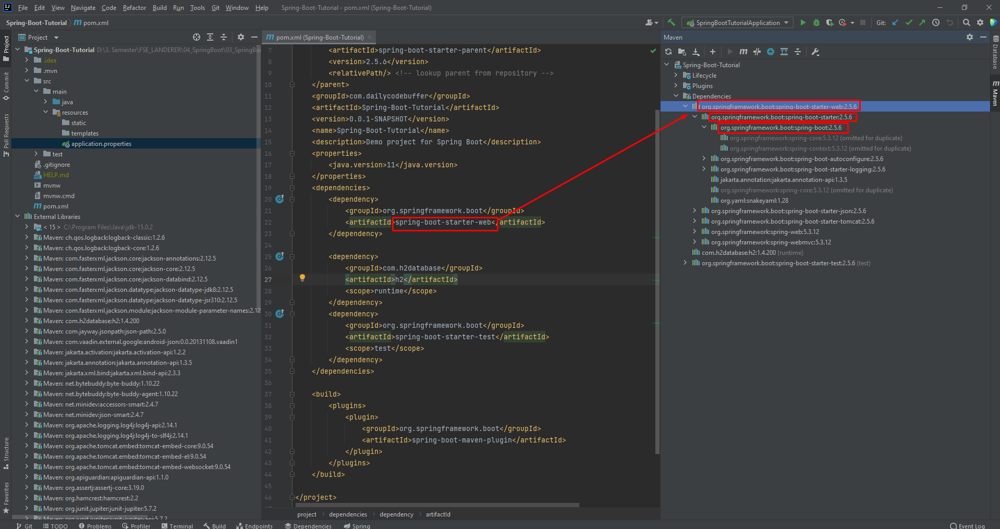

# Spring Boot - Dokumentation

## Aufgabe 3 : Spring Boot Fullstack Department-Management
**Link zum Tutorial**  
[Youtube - Spring Boot Tutorial | Full In-depth Course](https://www.youtube.com/watch?v=c3gKseNAs9w&ab_channel=DailyCodeBuffer)

---
---

### ***Spring Initializr***

#### Initialisieren des Projekts mit start.spring.io

- Hier kann man wie im IntelliJ direkt, ein Projekt mit SpringBoot initialisieren mit allen benötigten Abhängigkeiten

- Geht man auf Explore, kann man durch eine Vorschau sehen, was generiert werden würde

- Nun kann das Projekt generieren, und auch mit dem Share-Button einen Link teilen, der die Einstellungen zu diesem Projekt enthält

---
---

### ***Springboot IDE´s (IntelliJ IDEA, STS, VSCode,...)***

#### Laden des Projekts mit IntelliJ

- Nach dem Generieren des Projektes mit start.spring.io, kann man die Datei entpacken und das gesamte Projekt in das gewünschte Verzeichnis verschieben
- Anschließend öffnet man in IntelliJ die pom.xml-Datei und das Projekt wird geladen. 

---
---

### ***Springboot Starters***

#### Dependencies in den Starter-Dependencies

- die über start.spring.io ausgewählten Starter-Dependencies, enthalten auch jede Menge Abhängigkeiten die man dann benutzen kann

---
---

### ***Creating Simple API***

#### Neues Package, neuer Controller

- Die Programmierschnittstelle REST-API nutzt HTTP-Anfragen, um per PUT, GET, POST und DELETE auf Informationen zuzugreifen. Da REST das Verbinden mit Cloud-Diensten erlaubt und eine Interaktion ermöglicht, ist sie meist die erste Wahl. So sind REST-APIs zum Beispiel für Twitter, Amazon und Google im ständigen Einsatz
---

#### Spring erlaubt uns alle voreingestellten Properties zu ändern, wie zB der Standard-Port 8080 für Tomcat

---
---

### ***Running Springboot App***

#### Andere Annotation für RequestMapping, Starten der Application über das Terminal

- @GetMapping inkludiert bereits RequestMapping
- Über das Terminal kann der Run Befehl ausgeführt werden, mit Strg+C wird abgebrochen

---
---

### ***Spring Boot DevTools***

#### Neue Abhängigkeit, damit jede Änderung sofort übernommen wird, und die App nicht neu gestartet werden muss

- Dependency kann über start.spring.io ausgewählt werden, und mit EXPLORE kann dann der erstellte Code kopiert und in das Projekt in IntelliJ in der pom.xml übernommen werden. Maven aktualisieren und die neue Abhängigkeit wurde übernommen

#### Zusätzliche notwendige Einstellung in IntelliJ

- Nun muss die App nicht immer wieder neu gestarten werden, wenn Änderungen vorgenommen werden

---
---

### ***Architecture & Example***

#### Hier wird gezeigt, wie die kommende Aufgabe aufgebaut wird

- Die REST API
- Service Layer für die gesamte Buisness Logik
- Data Access / Repository Layer für die Interaktion mit der Datenbank
- Database ( zuerst mit H2, dann mit MySQL)

--- 
---

### ***Adding Dependency H2 & JPA***

#### Copy Paste von spring JPA starter in die pom.xml

- auf der start.spring.io kann das Dependency wieder ausgewählt, mit Explore betrachtet und dann kopiert und in die pom.xml des Intellij Projektes eingefügt werden. 

#### Konfigurieren der H2-Database

---
---

### ***Creating Springboot Components***

#### Neue Packages, erste Entity Department

- Damit die Entity Department mit der Database interagieren kann, muss sie mit der @Entity versehen werden.
- wieder setzen des Primary Key mit entsprechenden Annotations

#### DepartmentController 

- Annotation RestController für API

#### Interface und Klasse für Service 

- Annotation Service enthält auch @Component -> Spring

#### Repository Interface 

- Annotation Repository für die JPA-Repository
- erbt von JpaRepository mit allen bereits erstellten Methoden

---
---

### ***Department Save API***

#### Herstellung der Implementierungen zum Speichern

- @Autowired verbindet das Objekt mit dem Spring-Container
- @RequestBody erzeugt aus dem JSON-Objekt ein Objekt vom Typ Department
- Entkopplung mit den Implementierungen

---
---

### ***Testing APIs Using Rest Client***

#### Man muss anscheinend Insomnia installieren, wie das nun alles genau funktioniert hab ich nicht verstanden weil ich den Typ auch teilweise NULL verstehen kann. zum kotzen

- neue Collection erstellen
- new Request (POST)
- im Feld dann die URL eingeben zu den departments von H2

#### Format JSON wählen

#### Format JSON wählen

- Die Felder definieren (wie in Klasse Departments beschrieben)
- Die ID wird automatisch generiert
- 200 OK bedeutet der Request war erfolgreich

#### auf H2 kann man nun mit run sehen, dass die Daten übernommen wurden

---
---

### ***GetMapping_Fetching Data From DB***

#### GetMapping die eine List aller Einträge der Datenbank zurückgibt

- Diese Funktion übergibt uns alle Daten der Datenbank die verfügbar sind. 

#### Da die Daten beim beenden der App verloren gegangen sind, wurden 3 neue Einträge wie vorhin mit Insomnia erstellt und gesendet an die H2

#### Get Request auf Insomnia

  
---
---

### ***Fetching Data By ID***

#### Neue Methode mit GetMapping für die ID

#### Daten wurden wieder automatisch gelöscht (H2), 2 neue eingegeben; Durch Get-Request können jetzt sowohl alle Daten, als auch bestimmte IDs zurückgegeben werden

---
---

### ***Deleting Data***

#### Neue Methode mit @DeleteMapping mit der ID

#### Testen mit Insomnia

---
---

### ***Updating Data***

#### Neue Methode zum Updaten eines Departments mit @PutMapping

- Mit if-Abfragen wird überprüft, welche Felder des Datenfelders geändert werden wollen. Ergibt eine Abfrage 0 bzw nichts (also kein Update), wird es übersprungen
- Zum Schluss wird das gespeicherte Department (CRUD REPO) zurückgegeben. 

#### Testen mit Insomnia

- Wie programmiert, wird nur geändert was mit JSON gesendet wird, der Rest wird übersprungen

---
---

### ***Fetch Data By Name***

#### Neue Methode mit GetMapping um ein Department aus der Datenbank über den Namen zu finden

- Die Methode muss wieder im DepartmentController, im DepartmentService-Interface und der DepartmentServiceImpl geschrieben werden.
- Dieses kann aber nicht auf eine vordefinierte Methode zurückgegriffen werden und man muss selbst eine in das DepartmentRepository schreiben
- Hier reicht es aus den Methodenkopf so zu definieren, dass es heisst: findByDepartmentName. Wichtig hierbei Camelcase und die genau Bezeichnung des Datenfeldes von der Entity

#### Testen mit Insomnia

- wie man sieht, wird der Datensatz über den Department Name gefunden. 
- Allderdings ist hier die Groß- und Kleinschreibung wichtig. 

#### Noch eine Methode im DepartmentRepository

- Wie vorhin ist die Schreibweise hier wieder zu beachten
- Weiters muss diese Methode nun auch von ControllerServiceImpl aufgerufen werden.

#### Weiterer Test im Insomnia

- die suche funktioniert jetz auch so

#### so wie vorhin kann man die verschiedenen Möglichkeiten von JPA implementieren

- Auf dieser Seite sieht man wie mit den unterschiedlichen Methodennamen verschiedenes implementiert werden kann > 
[Spring Data JPA - Reference Doc](https://docs.spring.io/spring-data/jpa/docs/current/reference/html/#jpa.query-methods.query-creation)

#### **wie das nun genau funktioniert konnte ich leider wieder nicht verstehen weil ich wieder fast nichts verstanden habe von dem Inder**
---
---

### ******

####

---
---

### ******

####

---
---

### ******

####

---
---

### ******

####

---
---

