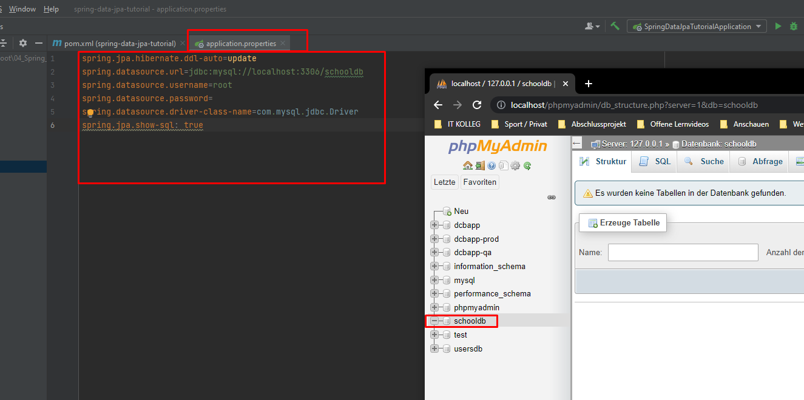

# Spring Boot - Dokumentation

## Aufgabe 4 : Spring Data JPA Vertiefung

**Link zum Tutorial**  
[Youtube - Spring Data JPA Tutorial | Full In-depth Course](https://www.youtube.com/watch?v=XszpXoII9Sg&ab_channel=DailyCodeBuffer)

---
---

### ***What we will build?***

#### UML

- Hier sieht man die unterschiedlichen Beziehungen der Tabellen zueinander

---
---

### ***Connecting Springboot App with DB***

#### Erstellen Projekt mit start.spring.io

- Dependencies

- Datenbank in phpmyAdmin erstellt und die Properties im Projekt gesetzt

---
---

### ***Mapping Entities with DB***

#### Student-Klasse (Tabelle)

- durch Entity wird der Klasse die Eigenschaft gegeben, eine Entitiät für die Datenbank zu sein
- mit Data bekommt man durch Lombok die Getter und Setters
- AllArgsConstructor und NoArgsConstructor gibt uns alle nötigen Konstruktoren
- Builder schreibt uns die Entität
- Die Klasse Student repräsentiert nun die Tabelle Student
- Id gibt der studentID den PrimaryKey

- Das Starten der App hat die automatische Erstellung der Tabelle Student in der Datenbank zur Folge

---
---

### ***Different JPA Annotations***

#### Modifizieren von Student

- @Table und @Column geben der Tabelle und der Spalte einen Namen
- @SequenceGenerator zählt die Einträge in der Tabelle sequenziell wie man es möchte
- @GeneratedValue gibt an, wie der Wert generiert werden soll (als sequenz), und was der Generator ist (student_sequenz)
- @Table gibt über uniqueConstraints die email-Adresse als einzigartig. Die email darf nicht leer sein sonst gibt es eine Exception
- Beim erneuten Starten der App wird eine neue Tabelle erzeugt mit gewünschtem namen, die Spalte email heisst jetzt anders, eine Sequenz wurde erzeugt, email ist unique
- Löscht man nun nochmal alle Tabellen der DB, wird beim erneuten starten der App die Tabelle mit allen Einstellungen neu erstellt

---
---

### ***Understanding Repositories and their methods***

#### Interace StudentRepository

- das Interface erbt von JPARepository.
- dieses Interface gibt uns die Möglichkeit, über die Einträge in der Datenbank zu iterieren

#### TestRepository Student

- zum testen der Application
- Ein Beispiel für die Datenbank wurde erstellt, und über das Autowired mit dem Repo verknüpft -> die Daten wurden in Datenbank gespeichert

---
---

### ***@Embeddable and @Embedded***

#### Guardian in eigener Klasse

- Guardian wird in eine eigene Klasse ausgelagert
- @Embeddable macht die Klasse Guardian einbettbar
- @AttributeOverrides können die Attribute der Klasse für die Spalten überschrieben werden
- @Embedded bettet das Objekt in die Klasse Student ein
- saveStudentWithGuardian() speichert nun den Guardian über ein Objekt-builder in das build von Student und schreibt es in die Datenbank

---
---

### **Creating JPA Repositories & methods***

#### Student Repo Methoden hinzufügen

- unter Beachtung von CamelCase können nun Methoden zum iterieren der Daten in der Tabelle erstellt werden. Es werden auch schon automatisch Methdoen zum implementieren vorgeschlagen.

- JPA übernimmt hier das iterieren
- weitere Methoden wurden hier ausprobiert

---
---

### ***@Query Annotation***

- JPQL steht für Java Persistence Query Language. Es wird verwendet, um Abfragen gegen Entitäten zu schaffen, um in einer relationalen Datenbank zu speichern. JPQL wird basierend auf SQL-Syntax entwickelt.

---
---

### ***Native Queries***

- dasselbe kann auch mit Native Querys angewendet werden, zB dann auch für komplexere Abfragen

---
---

### ***Query Named Params***

- dasselbe Ergebnis auch mit Parameter

---
---

### ***@Transactional and @Modifying Annotation***

- zum Updaten der Daten

---
---

### ***JPA One-To-One Relationship***

#### One-To-One mit Course und CourseMaterial

- Erstellung der Entitäten und der Beziehung zueinander

- Beiden Klassenentitäten wurden erstellt
- Jede bekommt wieder Getter, Setter, Konstruktoren, usw..
- Jede hat einen Primary Key mit SequenceGenerator
- CourseMaterial bekommt die Beziehung zu Course
  - One-To-One
  - JoinColumn für Course, und was der Fremdschlüssel sein soll
- Anschließend wird beim Starten der App die Datenbank dementsprechend aktualisiert

#### Repository für Course und CourseMaterial

- Die Repos für die Course und CourseMaterial wurden erstellt
- Eine Neue TestKlasse für CourseMaterial wurde generiert. 
- Eine Methode zum Speichern eines CourseMaterial-Eintrages wurde geschrieben in Verbindung mit einem Course
- Möchte man diese Methode testen schlägt sie fehlt, weil CourseMaterial nur in Verbindung mit einem Course gespeichert werden. Da es noch keinen Course-Eintrag gibt, schlägt dieser Test fehlt
- Cascading soll da im nächsten Abschnitt abhilfe schaffen

---
---

### ***Cascade Types***

#### Link zur Beschreibung von Cascading Types

[JPA-Cascading Types](https://www.baeldung.com/jpa-cascade-types)

---

#### Einbau Cascading in CourseMaterial One-To-One Annotation

- in der One-To-One Annotation wurde Cascading eingebaut
- Nun Funktioniert auch der Test

---
---

### ***Fetch Types***

- OnetoOne wird noch ein Fetch-Typ hinzugefügt
- da es auch mit Course verknüpft ist schlägt es fehl, wenn nicht über eine ToString Annotation der Course herausgenommen wird

---
---

### ***Uni & Bi directional relationship***

- In der Entity Course wird einem Objekt von CourseMaterial durch @OneToOne(mappedBy = "course") gesagt, dass es bereits gemappt ist mit Course. Dadruch erfolgt bei der Ausgabe von printCourses() in der TestRepo von Courses auch die Ausgabe von CourseMaterial

---
---

### ***JPA One-To-Many Relationship***

####

---
---

### ***JPA Many-To-One Relationship***

####

---
---

### ***Paging and Sorting***

####

---
---

### ***JPA Many-To-Many Relationship***

####

---
---
